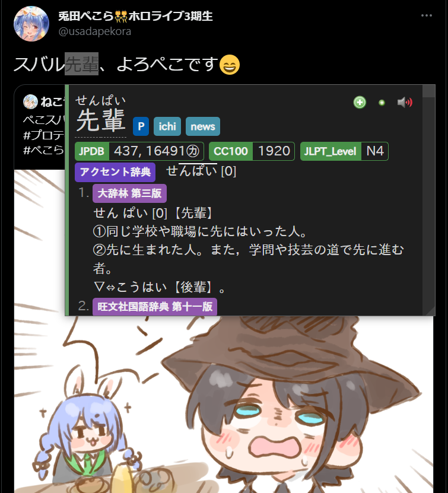
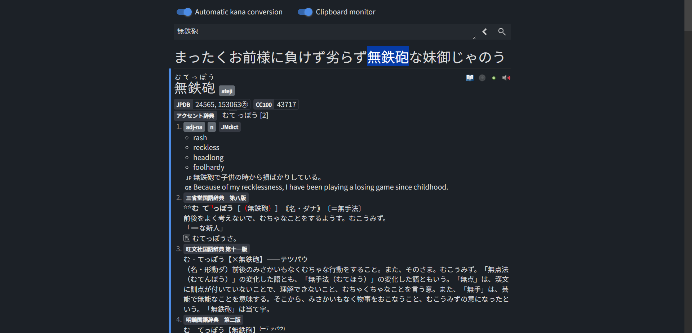

# JP-study

- [Anki Mining Template](#anki-mining-template)
- [Yomichan settings](#yomichan-settings)
    - [Dictionaries](#dictionaries)
    - [Popup Appearance custom CSS](#popup-appearance-custom-css)
    - [Fields](#fields)
    - [Custom Card Templates (Handlebars)](#custom-card-templates-handlebars)

## Anki Mining Template

[Link](https://drive.google.com/drive/u/2/folders/1et5YNL6pGRwELfWSTRpIs-pwFVX74Nbq)


## Yomichan settings

 [PC](./pc.json), [Mobile](./mobile.json)

### Dictionaries
| Dictionary | Priority | Link |
|----------|----------|----------|
| JPDB | 2 | [2](https://github.com/MarvNC/jpdb-freq-list) |
| CC100 | 1 | [1](https://drive.google.com/drive/folders/1tTdLppnqMfVC5otPlX_cs4ixlIgjv_lH) |
| JLPT_Level | 0 | [3](https://docs.google.com/document/d/1IUWkvBxhoazBSTyRbdyRVk7hfKE51yorE86DCRNQVuw/edit) |
| アクセント辞典 | 1 | [1](https://drive.google.com/drive/folders/1tTdLppnqMfVC5otPlX_cs4ixlIgjv_lH) |
| NHK | 0 | [1](https://drive.google.com/drive/folders/1tTdLppnqMfVC5otPlX_cs4ixlIgjv_lH) |
| 実用日本語表現辞典 | 20 | [1](https://drive.google.com/drive/folders/1tTdLppnqMfVC5otPlX_cs4ixlIgjv_lH) |
| 大辞林 第三版 | 19 | [1](https://drive.google.com/drive/folders/1tTdLppnqMfVC5otPlX_cs4ixlIgjv_lH) |
| 旺文社国語辞典 第十一版 | 18 | [1](https://drive.google.com/drive/folders/1tTdLppnqMfVC5otPlX_cs4ixlIgjv_lH) |
| デジタル大辞泉 | 17 | [1](https://drive.google.com/drive/folders/1tTdLppnqMfVC5otPlX_cs4ixlIgjv_lH) |
| 明鏡国語辞典 第二版 | 16 | [1](https://drive.google.com/drive/folders/1tTdLppnqMfVC5otPlX_cs4ixlIgjv_lH) |
| 新明解国語辞典　第七版 | 15 | [1](https://drive.google.com/drive/folders/1tTdLppnqMfVC5otPlX_cs4ixlIgjv_lH) |
| Nico/Pixiv | 14 | [1](https://drive.google.com/drive/folders/1tTdLppnqMfVC5otPlX_cs4ixlIgjv_lH) |
| JMdict (English) | 13 | [4](https://github.com/Aquafina-water-bottle/jmdict-english-yomichan) |
| JLPT文法解説まとめ | 5 | [1](https://drive.google.com/drive/folders/1tTdLppnqMfVC5otPlX_cs4ixlIgjv_lH) |
| 日本語文法辞典(全集) | 4 | [1](https://drive.google.com/drive/folders/1tTdLppnqMfVC5otPlX_cs4ixlIgjv_lH) |

### Popup Appearance custom CSS



```css
body {
   font-family: IPAexGothic;
}

/* https://learnjapanese.moe/yomicss/#light-dark-mode-varying-css */
.source-text {
    font-family: UD Digi Kyokasho N-R;
}
:root[data-theme="dark"] {
    --glossary-color: #a89984;
    --ruby-color: #b8bb26;
    --kanji-text-color: #fabd2f;
    --accent-color: #689d6a;
    --accent-color-lighter: #90b791;
    --progress-bar-track-color: #458588;
}

/* Fix quotes (https://aquafina-water-bottle.github.io/jp-mining-note/jpresources/#ensuring-properly-quotes-the-text) */
.jp-quote-text {
    text-indent: -1em;
    padding-left: 1em;
}

/* Only show NHK pitch when アクセント辞典 doesn't have data */
:not(ol[data-count='1']) > li.pronunciation-group[data-dictionary='NHK'] {
    display: none;
}
ol.pronunciation-group-list[data-count='2'] {
    list-style: none;
    padding: 0;
}

/* Only show JMDict on hover */
.definition-list li.definition-item[data-dictionary='JMdict (English)'] .gloss-list {
    opacity: 0;
}
.definition-list:has(li.definition-item[data-dictionary='JMdict (English)']:hover) .gloss-list {
    opacity: 1;
}

/* Disable furigana selection */
ruby rt {
    user-select: none;
}
```

### Fields
| Field | Value |
|----------|----------|
| Expression | `{expression}` |
| Expression (furigana) | `{furigana-plain}` | 
| Expression (reading) | `{reading}` |
| Expression (audio) | `{audio}` | 
| MainDefinition | `{main-def}`|
| Sentence | `{cloze-prefix}<b>{cloze-body}</b>{cloze-suffix}` | 
| Sentence (furigana) |  |
| Sentence (audio) |  | 
| FullDefinition | `{glossary}` |
| Image |  | 
| Translation |  |
| PitchPosition | `{pitch-accent-positions}` |
| Hint |  |
| Frequency | `{frequencies}` | 
| FreqSort | `{freq}` |
| MiscInfo | `{document-title}` | 
| Extra | `{jlpt} {ln}` |
| *IsSentenceCard | `{grammar-pt}` | 

Notes:
- When **\*IsSentenceCard** isn't empty, card is turned into a sentence card. When empty, it's a vocab card.
- **PitchPosition** takes `{pitch-accent-positions}`. `{pitch-accents}` and `{pitch-accent-graphs}` do not work.
- `{main-def}`, `{freq}`, `{jlpt}`, `{ln}`, and `{grammar-pt}` are custom templates/handlebars
- **Hint** is for a hint on the front of the card.
- **Sentence (furigana)** is for furigana generated from [AJT Furigana](https://ankiweb.net/shared/info/1344485230) (Anki addon)
- **Sentence (audio)**, **Image**, **Translation** are for data from [Mpvacious](https://github.com/Ajatt-Tools/mpvacious). **Sentence**, **MiscInfo** are overwritten by data from Mpvacious as well.
- **Extra** is for space-separated tags to be generated through [Field to Tag](https://ankiweb.net/shared/info/1600845494) (Anki addon)

### Custom Card Templates (Handlebars)

- `{freq}` - frequency value for sorting new cards. [Link](https://github.com/MarvNC/JP-Resources#sorting-mined-anki-cards-by-frequency).

```handlebars
{{#*inline "freq"}}
    {{~! Frequency sort handlebars: v23.02.05.1 ~}}
    {{~! The latest version can be found at https://github.com/MarvNC/JP-Resources ~}}
    {{~#scope~}}
        {{~! Options ~}}
        {{~#set "opt-ignored-freq-dict-regex"~}} ^(JLPT_Level)$ {{~/set~}}
        {{~#set "opt-keep-freqs-past-first-regex"~}} ^()$ {{~/set~}}
        {{~set "opt-no-freq-default-value" 0 ~}}
        {{~set "opt-freq-sorting-method" "harmonic" ~}} {{~! "min", "first", "avg", "harmonic" ~}}
        {{~! End of options ~}}

        {{~! Do not change the code below unless you know what you are doing. ~}}
        {{~set "result-freq" -1 ~}} {{~! -1 is chosen because no frequency dictionaries should have an entry as -1 ~}}
        {{~set "prev-freq-dict" "" ~}}
        {{~set "t" 1 ~}}

        {{~#each definition.frequencies~}}

            {{~! rx-match-ignored-freq is not empty if ignored <=> rx-match-ignored-freq is empty if not ignored ~}}
            {{~#set "rx-match-ignored-freq" ~}}
                {{~#regexMatch (get "opt-ignored-freq-dict-regex") "gu"~}}{{this.dictionary}}{{~/regexMatch~}}
            {{/set~}}
            {{~#if (op "===" (get "rx-match-ignored-freq") "") ~}}

                {{~!
                    only uses the 1st frequency of any dictionary.
                    For example, if JPDB lists 440 and 26189㋕, only the first 440 will be used.
                ~}}
                {{~set "read-freq" false ~}}
                {{~#if (op "!==" (get "prev-freq-dict") this.dictionary ) ~}}
                    {{~set "read-freq" true ~}}
                    {{~set "prev-freq-dict" this.dictionary ~}}
                {{/if~}}

                {{~#if (op "!" (get "read-freq") ) ~}}
                    {{~#set "rx-match-keep-freqs" ~}}
                        {{~#regexMatch (get "opt-keep-freqs-past-first-regex") "gu"~}}{{this.dictionary}}{{~/regexMatch~}}
                    {{/set~}}

                    {{~! rx-match-keep-freqs is not empty if keep freqs ~}}
                    {{~#if (op "!==" (get "rx-match-keep-freqs") "") ~}}
                        {{~set "read-freq" true ~}}
                    {{/if~}}
                {{/if~}}

                {{~#if (get "read-freq") ~}}
                    {{~set "f" (op "+" (regexMatch "\d+" "" this.frequency)) ~}}

                    {{~#if (op "===" (get "opt-freq-sorting-method") "min") ~}}
                        {{~#if
                            (op "||"
                                (op "===" (get "result-freq") -1)
                                (op ">" (get "result-freq") (get "f"))
                            )
                        ~}}
                            {{~set "result-freq" (op "+" (get "f")) ~}}
                        {{~/if~}}

                    {{~else if (op "===" (get "opt-freq-sorting-method") "first") ~}}
                        {{~#if (op "===" (get "result-freq") -1) ~}}
                            {{~set "result-freq" (get "f") ~}}
                        {{~/if~}}

                    {{~else if (op "===" (get "opt-freq-sorting-method") "avg") ~}}

                        {{~#if (op "===" (get "result-freq") -1) ~}}
                            {{~set "result-freq" (get "f") ~}}
                        {{~else~}}
                            {{~!
                                iterative mean formula (to prevent floating point overflow):
                                    $S_{(t+1)} = S_t + \frac{1}{t+1} (x - S_t)$
                                - example java implementation: https://stackoverflow.com/a/1934266
                                - proof: https://www.heikohoffmann.de/htmlthesis/node134.html
                            ~}}
                            {{~set "result-freq"
                                (op "+"
                                    (get "result-freq")
                                    (op "/"
                                        (op "-"
                                            (get "f")
                                            (get "result-freq")
                                        )
                                        (get "t")
                                    )
                                )
                            }}
                        {{~/if~}}
                        {{~set "t" (op "+" (get "t") 1) ~}}

                    {{~else if (op "===" (get "opt-freq-sorting-method") "harmonic") ~}}
                        {{~#if (op ">" (get "f") 0) ~}} {{~! ensures only positive numbers are used ~}}
                            {{~#if (op "===" (get "result-freq") -1) ~}}
                                {{~set "result-freq" (op "/" 1 (get "f")) ~}}
                            {{~else ~}}
                                {{~set "result-freq"
                                    (op "+"
                                        (get "result-freq")
                                        (op "/" 1 (get "f"))
                                    )
                                }}
                                {{~set "t" (op "+" (get "t") 1) ~}}
                            {{~/if~}}
                        {{~/if~}}

                    {{~else if (op "===" (get "opt-freq-sorting-method") "debug") ~}}

                        {{ this.dictionary }}: {{ this.frequency }} -> {{ get "f" }} <br>

                    {{~else~}}
                        (INVALID opt-freq-sorting-method value)
                    {{~/if~}}

                {{~/if~}}

            {{~/if~}}

        {{~/each~}}

        {{~! (x) >> 0 apparently floors x: https://stackoverflow.com/a/4228528 ~}}
        {{~#if (op "===" (get "result-freq") -1) ~}}
            {{~set "result-freq" (get "opt-no-freq-default-value") ~}}
        {{~ else if (op "===" (get "opt-freq-sorting-method") "avg") ~}}
            {{~set "result-freq"
                (op ">>" (get "result-freq") 0 )
            ~}}
        {{~ else if (op "===" (get "opt-freq-sorting-method") "harmonic") ~}}
            {{~set "result-freq"
                (op ">>"
                    (op "*"
                        (op "/" 1 (get "result-freq"))
                        (get "t")
                    )
                    0
                )
            ~}}
        {{~/if~}}

        {{~get "result-freq"~}}
    {{~/scope~}}
{{/inline}}
```

- `{main-def}` - for the **MainDefinition** field. If text is selected, return `{selection-text}` otherwise return `{jmdict-def}` (English/JMDict definition).
```handlebars
{{~#*inline "jmdict-def"~}}
    <div style="text-align: left;">
    {{~#scope~}}
        {{~#if (op "===" definition.type "term")~}}
            {{~#if (op "===" this.dictionary "JMdict (English)")~}}
                {{~> glossary-single definition brief=brief noDictionaryTag=noDictionaryTag ~}}
            {{/if}}
        {{~else if (op "||" (op "===" definition.type "termGrouped") (op "===" definition.type "termMerged"))~}}
            {{~#set "jmdict-length" 0}}{{/set~}}
            {{~#each definition.definitions~}}
                {{~#if (op "===" this.dictionary "JMdict (English)")~}}
                    {{~#set "jmdict-length" (op "+" (get "jmdict-length") 1) ~}}{{~/set~}}
                {{~/if~}}
            {{~/each~}}

            {{~#if (op ">" (get "jmdict-length") 1)~}}
                <ol>{{~#each definition.definitions~}}{{~#if (op "===" this.dictionary "JMdict (English)")~}}<li>{{~> glossary-single . brief=../brief noDictionaryTag=../noDictionaryTag ~}}</li>{{/if}}{{~/each~}}</ol>
            {{~else~}}
                {{~#each definition.definitions~}}{{~#if (op "===" this.dictionary "JMdict (English)")~}}{{~> glossary-single . brief=../brief noDictionaryTag=../noDictionaryTag ~}}{{/if}}{{~/each~}}
            {{~/if~}}
        {{~/if~}}
    {{~/scope~}}
    </div>
{{~/inline~}}

{{~#*inline "main-def"~}}
    {{~#set "selected"}}{{~> selection-text}}{{/set~}}
    {{~#set "exp"}}{{~> expression}}{{/set~}}

    {{~#if (op "&&" (op "!==" (get "selected") "") (op "!==" (get "selected") (get "exp")))}}
        {{~> selection-text}}
    {{~else~}}
        {{~> jmdict-def noDictionaryTag=true brief=true ~}}
    {{/if~}}
{{~/inline~}}
```

- `{jlpt}` - space-separated jlpt tags for the [Field to Tag](https://ankiweb.net/shared/info/1600845494) add-on.

```handlebars
{{~#*inline "jlpt"~}}
    {{~#if (op ">" definition.frequencies.length 0)~}}
        {{~#each definition.frequencies~}}
            {{~#if (op "===" this.dictionary "JLPT_Level")~}}
                JLPT_{{frequency~}}
                {{#unless @last}} {{/unless}}
            {{~/if~}}
        {{~/each~}}
    {{~/if~}}
{{/inline}}
```

- `{ln}` - "ラノベ" and the LN title tags for the [Field to Tag](https://ankiweb.net/shared/info/1600845494) add-on when on `reader.ttsu.app`.

```handlebars
{{#*inline "ln"}}
    {{~#set "ttsu" ~}}
        {{~#regexMatch "reader\.ttsu\.app"~}} {{definition.url}} {{~/regexMatch~}}
    {{/set~}}
    {{~#if (op "!==" "" (get "ttsu"))~}}
        ラノベ 
        {{#regexReplace "　" "_" "g"~}}
            {{~#regexReplace "\| ッツ Ebook Reader" ""~}}{{~context.document.title~}}{{/regexReplace~}}
        {{/regexReplace~}}
    {{~/if~}}
{{/inline}}
```

- `{grammar-pt}` - fills out **\*IsSentenceCard** Field when a grammar dictionary has an entry.

```handlebars
{{#*inline "grammar-pt"}}
    {{~#set "is-grammar" false}}{{/set~}}
    {{~#each definition.definitions~}}
        {{~#if (op "||" (op "===" this.dictionary "JLPT文法解説まとめ") (op "===" this.dictionary "日本語文法辞典(全集)"))~}}
            {{~#set "is-grammar" true ~}}{{~/set~}}
        {{~/if~}}
    {{~/each~}}
    {{~#if (op "===" (get "is-grammar") true)~}}x{{/if}}
{{/inline}}
```