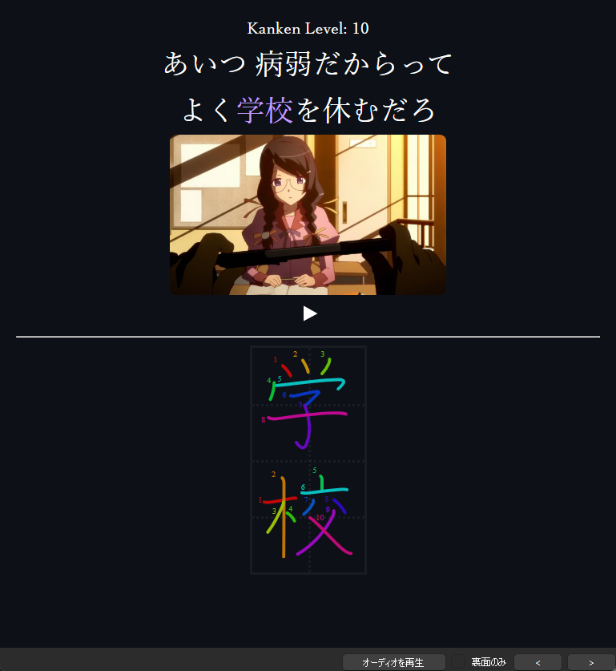

# JP-study

- [Anki Mining Template](#anki-mining-template)
    - [Yomichan fields](#yomichan-fields)
    - [Other applications/add-ons](#other-applicationsadd-ons)
- [Yomichan Handlebars templates](#yomichan-handlebars-templates)
- [Yomichan popup custom CSS](#yomichan-popup-custom-css)
- [Kanken Deck Template](#kanken-deck-template)

## Anki Mining Template

Mining card template I use for Anki. I usually use it with [mpvacious](https://github.com/Ajatt-Tools/mpvacious) and [Yomichan](https://chrome.google.com/webstore/detail/yomichan/ogmnaimimemjmbakcfefmnahgdfhfami).

[Preview (PC only)](https://rudnam.github.io/JP-study/mining_preview.html)

[Download](https://github.com/rudnam/JP-study/raw/main/Mining_temp.apkg)


<p align="center">
    <kbd></kbd>
    <kbd></kbd>
    <kbd></kbd>
</p>


### Yomichan fields

How I fill the mining template's fields from Yomichan.
| Field | Value |
|----------|----------|
| Expression | `{expression}` |
| Expression (furigana) | `{furigana-plain}` | 
| Expression (reading) | `{reading}` |
| Expression (audio) | `{audio}` | 
| MainDefinition | `{main-def}`|
| Sentence | `{cloze-prefix}<b>{cloze-body}</b>{cloze-suffix}` | 
| Sentence (furigana) |  |
| Sentence (audio) |  | 
| FullDefinition | `{glossary}` |
| Image |  | 
| Translation |  |
| PitchPosition | `{pitch-accent-positions}` |
| Hint |  |
| Frequency | `{frequencies}` | 
| FreqSort | `{freq}` |
| MiscInfo | `{document-title}` | 
| ExtraField |  |
| *IsSentenceCard | `{grammar-pt}` | 

Notes:
- When **\*IsSentenceCard** is filled with any character, card is turned into a sentence card. When empty, it is turned into a vocab card.
- **PitchPosition** takes in `{pitch-accent-positions}`. `{pitch-accents}` and `{pitch-accent-graphs}` will **not** work.
- `{main-def}`, `{freq}`, and `{grammar-pt}` are [custom templates/handlebars](#yomichan-handlebars-templates).
- **Hint** is for a hint on the front of the card (See [Animecards](https://animecards.site/ankicards/#the-hint-field)).
- The furigana fields only take in plain furigana. (e.g. 漢字[かんじ] not <ruby>漢字<rt>かんじ</rt></ruby>).

### Other applications/add-ons

More info can be added using other applications and add-ons.

- I usually use the fields **Sentence**, **Translation**, **Sentence (audio)**, **Image**, and **MiscInfo** for data from [mpvacious](https://github.com/Ajatt-Tools/mpvacious). In `subs2srs.conf`:

    ```
    model_name=Mining-JA

    sentence_field=Sentence
    secondary_field=Translation
    audio_field=Sentence (audio)
    image_field=Image
    miscinfo_field=MiscInfo

    # The tag(s) added to new notes. Spaces separate multiple tags.
    note_tag=subs2srs アニメ::%n 
    ```

- I use [FieldReporter](https://ankiweb.net/shared/info/569864517) for reordering cards based on the **FreqSort** field. The addon also supports converting a field to a tag but it doesn't support adding multiple tags so I use my own [fork](https://github.com/rudnam/FieldReporter) with **ExtraField** as the source field:
    | Field | Value |
    |----------|----------|
    | ExtraField | `{jlpt}${context}` |
    
    `{jlpt}` and `{context}` are [custom templates/handlebars](#yomichan-handlebars-templates).

## Yomichan Handlebars templates

Custom Yomichan Handlebars templates for toggling between English and Japanese definitions and adding extra info such as average frequency rank and context tags.

- `{freq}` - Gives the frequency value for sorting new cards. From [MarvNC](https://github.com/MarvNC/JP-Resources#sorting-mined-anki-cards-by-frequency). Copy it from here: [https://github.com/MarvNC/JP-Resources#freq-handlebar](https://github.com/MarvNC/JP-Resources#freq-handlebar)


- `{main-def}` - If text is selected, the extracted definition is the highlighted text, otherwise defaults to the English/JMDict definition.
    ```handlebars
    {{~#*inline "jmdict-def"~}}
        <div style="text-align: left;">
        {{~#scope~}}
            {{~#if (op "===" definition.type "term")~}}
                {{~#if (op "===" this.dictionary "JMdict (English)")~}}
                    {{~> glossary-single definition brief=brief noDictionaryTag=noDictionaryTag ~}}
                {{/if}}
            {{~else if (op "||" (op "===" definition.type "termGrouped") (op "===" definition.type "termMerged"))~}}
                {{~#set "jmdict-length" 0}}{{/set~}}
                {{~#each definition.definitions~}}
                    {{~#if (op "===" this.dictionary "JMdict (English)")~}}
                        {{~#set "jmdict-length" (op "+" (get "jmdict-length") 1) ~}}{{~/set~}}
                    {{~/if~}}
                {{~/each~}}

                {{~#if (op ">" (get "jmdict-length") 1)~}}
                    <ol>{{~#each definition.definitions~}}{{~#if (op "===" this.dictionary "JMdict (English)")~}}<li>{{~> glossary-single . brief=../brief noDictionaryTag=../noDictionaryTag ~}}</li>{{/if}}{{~/each~}}</ol>
                {{~else~}}
                    {{~#each definition.definitions~}}{{~#if (op "===" this.dictionary "JMdict (English)")~}}{{~> glossary-single . brief=../brief noDictionaryTag=../noDictionaryTag ~}}{{/if}}{{~/each~}}
                {{~/if~}}
            {{~/if~}}
        {{~/scope~}}
        </div>
    {{~/inline~}}

    {{~#*inline "main-def"~}}
        {{~#set "selected"}}{{~> selection-text}}{{/set~}}
        {{~#set "pattern"~}}[{{~> cloze-body}}]{{~/set~}}
        {{~#set "diff"}}{{~#regexReplace (get "pattern") ""~}}{{~#get "selected"}}{{/get~}}{{~/regexReplace~}}{{/set~}}
    
        {{~#if (op ">" (property (get "diff") "length") (op "-" (property (get "selected") "length") (property (get "diff") "length")))}}
            {{~> selection-text}}
        {{~else~}}
            {{~> jmdict-def noDictionaryTag=true brief=true ~}}
        {{/if~}}
    {{~/inline~}}
    ```

- `{grammar-pt}` - fills out a field when a grammar dictionary has an entry.

    ```handlebars
    {{#*inline "grammar-pt"}}
        {{~#set "grammar-dicts" ~}}
            {{~#regexMatch "JLPT文法解説まとめ|日本語文法辞典\(全集\)"~}}
                {{~> glossary}}
            {{~/regexMatch~}}
        {{/set~}}
        {{~#if (op "!==" "" (get "grammar-dicts"))~}}x{{/if}}
    {{/inline}}
    ```

- `{jlpt}` - JLPT tags for [FieldReporter](https://github.com/rudnam/FieldReporter).

    ```handlebars
    {{~#*inline "jlpt"~}}
        {{~#if (op ">" definition.frequencies.length 0)~}}
            {{~#each definition.frequencies~}}
                {{~#if (op "===" this.dictionary "JLPT_Level")~}}
                    JLPT_{{frequency~}}{{#unless @last}}${{/unless}}
                {{~/if~}}
            {{~/each~}}
        {{~/if~}}
    {{/inline}}
    ```

- `{context}` - Context tags for [FieldReporter](https://github.com/rudnam/FieldReporter). Tags like `ラノベ::また、同じ夢を見ていた` if in mokuro, etc.

    ```handlebars
    {{#*inline "context"}}
        {{~#if (regexMatch "reader\.ttsu\.app" "" definition.url)~}}
            ラノベ::{{~context.document.title~}}
        {{~else if (regexMatch "mokuro" "" context.document.title)~}}
            漫画::{{~context.document.title~}}
        {{~else if (regexMatch "nhk.or.jp" "" definition.url)~}}
            {{~#set "news-category" ~}}
                {{~#regexMatch "[^(||｜)]+$"~}} {{~context.document.title~}} {{~/regexMatch~}}
            {{/set~}}
            ニュース::{{~get "news-category"~}}
        {{~else if (regexMatch "twitter.com" "" definition.url)~}}
            {{~set "twitter-user" (regexMatch ".+?(?= on|さん)" "" context.document.title)~}}
            ツイッター::{{~get "twitter-user"~}}
        {{~else if (regexMatch "youtube.com" "" definition.url)~}}
            {{~set "youtube-title" (regexMatch ".+?(?= - YouTube)" "" context.document.title)~}}
            ユーチューブ::{{~get "youtube-title"~}}
        {{~/if~}}
    {{/inline}}
    ```

## Yomichan popup custom CSS

Custom CSS for changing the Yomichan popup appearance.


<kbd></kbd>

<br>

Font download links:
- Source Sans 3: [https://fonts.google.com/specimen/Source+Sans+3](https://fonts.google.com/specimen/Source+Sans+3)
- Source Han Sans: [https://github.com/adobe-fonts/source-han-sans/raw/release/Variable/TTF/SourceHanSans-VF.ttf](https://github.com/adobe-fonts/source-han-sans/raw/release/Variable/TTF/SourceHanSans-VF.ttf)
- UD Digi Kyokasho N-R: [https://learnjapanese.moe/font/#windows-10](https://learnjapanese.moe/font/#windows-10)

Just copy and paste the following CSS into Yomichan's custom CSS.

```css
body {
    font-family: "Source Sans 3", "Source Han Sans VF", sans-serif;
}

.source-text {
    font-family: "UD Digi Kyokasho N-R";
}

:root[data-theme="dark"] {
    --text-color: #ffffff;
    --background-color: #0d1117;
    --accent-color: #2D4446;
    --accent-color-lighter: #416265;
    --tag-pronunciation-dictionary-background-color: #2d3746;
    --tag-dictionary-background-color: #2F2D46;
    --tag-frequency-background-color: #2D4446;
    --tag-default-background-color: #51647E;
    --tag-name-background-color: #3d4993;
    --tag-expression-background-color: #4857AE;
    --tag-popular-background-color: #232d5a;
    --tag-frequent-background-color: #303e7c;
    --tag-archaism-background-color: #533642;
    --tag-part-of-speech-background-color: #303e7c;
    --input-background-color: #24292f;
    --link-color: #3d4993;
}

.tag-label {
    box-shadow: inset 0 1px 1px rgba(255,255,255,.1);
}

/* Fix quotes (https://aquafina-water-bottle.github.io/jp-mining-note/jpresources/#ensuring-properly-quotes-the-text) */
.jp-quote-text {
    text-indent: -1em;
    padding-left: 1em;
}

/* Only show NHK pitch when アクセント辞典 doesn't have data */
:not(ol[data-count='1']) > li.pronunciation-group[data-dictionary='NHK'] {
    display: none;
}
ol.pronunciation-group-list[data-count='2'] {
    list-style: none;
    padding: 0;
}

/* Only show JMDict on hover */
li.definition-item[data-dictionary='JMdict (English)'] .gloss-list {
    opacity: 0;
}
.definition-list:hover li.definition-item[data-dictionary='JMdict (English)'] .gloss-list {
    opacity: 1;
}
*:not([data-dictionary='JMdict (English)']):hover ~ li.definition-item[data-dictionary='JMdict (English)'] .gloss-list{
    opacity: 0;
}

/* Disable furigana on search page */
ruby.query-parser-segment > rt.query-parser-segment-reading {
    display: none;
}

/* Collapse lists of links */
.definition-item:not([data-dictionary="JMdict (English)"]) .gloss-list:has(.gloss-content > a:only-child) {
    list-style: none;
    display: inline;
    padding-left: 0;
}
.definition-item:not([data-dictionary="JMdict (English)"]) .gloss-list:has(.gloss-content > a:only-child) * {
    display: inline;
}
.definition-item:not([data-dictionary="JMdict (English)"]) .gloss-list:has(.gloss-content > a:only-child):not(:last-child)::after {
    content: " | ";
}

/* Collapse JMnedict entries */
.definition-item[data-dictionary="JMnedict"] .gloss-list {
    list-style: none;
    display: inline;
    padding-left: 0;
}
.definition-item[data-dictionary="JMnedict"] .gloss-list * {
    display: inline;
}
.definition-item[data-dictionary="JMnedict"] ul.gloss-list > li.gloss-item:not(:last-child)::after {
    content: " | ";
}
```

## Kanken Deck Template

Anki card template for the [Kanken Deck](https://ankiweb.net/shared/info/759825185).

<p align="center">
    <kbd></kbd>
</p>

Just copy and paste the following templates into Anki.

Font download link: [https://github.com/adobe-fonts/source-han-serif/raw/release/Variable/TTF/SourceHanSerif-VF.ttf](https://github.com/adobe-fonts/source-han-serif/raw/release/Variable/TTF/SourceHanSerif-VF.ttf)

- Front Template

    ```html
    <div id=deck deck_name="{{Deck}}"></div>
    <div id="content"> 
      Kanken Level: ?
      <div lang="ja" class="sentence_front">
        {{SentenceFront}}
      </div>
      {{#Picture}}
        {{Picture}}
        <br>
      {{/Picture}}	
      {{KankenAudio}}
      <hr>
      <div id="container">
        <div id="diagram" style="opacity: 0;">
          {{Diagram}}
        </div>
      </div>
    </div>

    <script>
      function addScriptToHead() {
        let head = document.getElementsByTagName('head')[0];

        // For loading japanese fonts from web
        let scriptElement = document.createElement('script');
        scriptElement.innerHTML = "(function(d) {var config = {kitId: 'uud0evt',scriptTimeout: 3000,async: true},h=d.documentElement,t=setTimeout(function(){h.className=h.className.replace(/\\bwf-loading\\b/g,'')+' wf-inactive';},config.scriptTimeout),tk=d.createElement('script'),f=false,s=d.getElementsByTagName('script')[0],a;h.className+=' wf-loading';tk.src='https://use.typekit.net/'+config.kitId+'.js';tk.async=true;tk.onload=tk.onreadystatechange=function(){a=this.readyState;if(f||a&&a!='complete'&&a!='loaded')return;f=true;clearTimeout(t);try{Typekit.load(config)}catch(e){}};s.parentNode.insertBefore(tk,s)})(document);";

        head.appendChild(scriptElement);
      }

      function makeGrid() {
        const TATEGAKI = true;      /* toggle vertical writing */
        const NUMOFBOXES = -1;      /* specify # of boxes; -1 to change based on word, 0 to hide */
        const MAXBOXSIZE = 140;     /* specify max boxsize (in px) */

        const boxSize = Math.min(document.documentElement.clientWidth/4.5, MAXBOXSIZE);
        const container = document.getElementById('container');
        const diagram = document.getElementById('diagram');

        for (child of diagram.children) {child.style.height = `${boxSize}px`; child.style.width = `${boxSize}px`;}
        const diagramHTML = container.innerHTML;

        let fullSize = NUMOFBOXES === -1 ? (boxSize * diagram.childElementCount) : (boxSize * NUMOFBOXES);
        let currSize = boxSize / 2;

        container.innerHTML = "";
        if (TATEGAKI) {
          container.style.height = `${fullSize}px`;
          container.style.width = `${boxSize}px`;
          container.innerHTML += `<div class="vert-line" style="height:${fullSize}px;width:${boxSize/2}px"></div>`
          while (currSize < fullSize) {
            container.innerHTML += `<div class="hori-line" style="height:${currSize}px;width:${boxSize}px;"></div>`
            currSize += boxSize / 2;
          }
          container.innerHTML += diagramHTML;
        } else {
          container.style.height = `${boxSize}px`;
          container.style.width = `${fullSize}px`;
          container.innerHTML += `<div class="hori-line" style="height:${boxSize/2}px;width:${fullSize}px"></div>`
          while (currSize < fullSize) {
            container.innerHTML += `<div class="vert-line" style="height:${boxSize}px;width:${currSize}px;"></div>`
            currSize += boxSize / 2;
          }
          container.innerHTML += diagramHTML;
        }
        
        if (NUMOFBOXES === 0) {
          container.style.border = "none";
          for (child of container.children) {
            child.style.border = "none";
          }
        }

        return;
      }

      makeGrid();
      if (navigator.userAgentData.mobile) {
        addScriptToHead();
      };
    </script>
    ```

- Back Template

    ```html
    <div id=deck deck_name="{{Deck}}"></div>
    <div id="content"> 
      Kanken Level: ?
      <div lang="ja" class="sentence_front">
        {{SentenceFront}}
      </div>
      {{#Picture}}
        {{Picture}}
        <br>
      {{/Picture}}	
      {{KankenAudio}}
      <hr>
      <div id="container">
        <div id="diagram">
          {{Diagram}}
        </div>
      </div>
      <div lang="ja" id="extra">
        {{Kana}}【{{Kanji}}】
        <br>
        {{Meaning}}
      </div>
    </div>

    <script>
      function makeGrid() {
        const TATEGAKI = true;      /* toggle vertical writing */
        const NUMOFBOXES = -1;      /* specify # of boxes; -1 to change based on word, 0 to hide */
        const MAXBOXSIZE = 140;     /* specify max boxsize (in px) */

        const boxSize = Math.min(document.documentElement.clientWidth/4.5, MAXBOXSIZE);
        const container = document.getElementById('container');
        const diagram = document.getElementById('diagram');

        for (child of diagram.children) {child.style.height = `${boxSize}px`; child.style.width = `${boxSize}px`;}
        const diagramHTML = container.innerHTML;

        let fullSize = NUMOFBOXES === -1 ? (boxSize * diagram.childElementCount) : (boxSize * NUMOFBOXES);
        let currSize = boxSize / 2;

        container.innerHTML = "";
        if (TATEGAKI) {
          container.style.height = `${fullSize}px`;
          container.style.width = `${boxSize}px`;
          container.innerHTML += `<div class="vert-line" style="height:${fullSize}px;width:${boxSize/2}px"></div>`
          while (currSize < fullSize) {
            container.innerHTML += `<div class="hori-line" style="height:${currSize}px;width:${boxSize}px;"></div>`
            currSize += boxSize / 2;
          }
          container.innerHTML += diagramHTML;
        } else {
          container.style.height = `${boxSize}px`;
          container.style.width = `${fullSize}px`;
          container.innerHTML += `<div class="hori-line" style="height:${boxSize/2}px;width:${fullSize}px"></div>`
          while (currSize < fullSize) {
            container.innerHTML += `<div class="vert-line" style="height:${boxSize}px;width:${currSize}px;"></div>`
            currSize += boxSize / 2;
          }
          container.innerHTML += diagramHTML;
        }

        
        if (NUMOFBOXES === 0) {
          container.style.border = "none";
          for (child of container.children) {
            child.style.border = "none";
          }
        }

        return;
      }
      makeGrid();
    </script>
    ```

- Styling

    ```css
    html.win,
    html.mac,
    html.linux:not(.android) {
      --main-font: "Source Han Serif", serif;
    }

    html.mobile {
      --main-font: source-han-serif-japanese, serif;
    }

    .card.nightMode {
      --main-bg: #0d1117;
      --sub-bg: #161b22;
      --main-color: #ffffff;
      --sub-color: #8b949e;
      --grey: rgba(128,128,128, 0.1);
      font-family: var(--main-font);
      background-color: var(--main-bg);
      color: var(--main-color);
      font-size: 20px;
      text-align: center;
    }

    #qa {
      display: flex;
      align-items: stretch;
      flex-direction: column;
      min-height: calc(100vh - 40px);
    }

    @font-face {
      font-family: "Source Han Serif";
      src: local("Source Han Serif VF"), url("_SourceHanSerif-Regular.otf");
    }


    /* ----- Front elements ----- */

    .sentence_front {font-size: 28px;}

    /* PC replay button */
    .replay-button {margin-top: -5px;}
    .replay-button svg {width: 30px; height: auto;}
    .replay-button svg path {fill: var(--main-color); transition: .2s;}
    .replay-button svg circle {fill: var(--main-bg); display: none;}
    .replay-button:hover svg path {fill: var(--sub-color);}

    /* Grid */
    #container {
      margin: auto;
      border-style: solid;
      border-color: var(--grey);
      background-color: rgba(255,255,255,0);
    }
    .vert-line {
      position: absolute;
      border-style: none;
      border-right-style: dotted;
      border-color: var(--grey);
    }
    .hori-line {
      position: absolute;
      border-style: none;
      border-bottom-style: dotted;
      border-color: var(--grey);
    }


    /* ----- Back elements ----- */

    /* Stroke diagram */
    #diagram {line-height: 0;}
    #diagram > img {
      height: 140px;
      width: 140px;
      position: relative;
      z-index: 100;
    }


    /* Extra info */
    #extra {
      opacity: 0;
    }

    #extra:hover {
      opacity: 1;
    }


    /* ---------- Misc ---------- */

    /* Remove default margins */
    * {
      margin: 0px;
      padding: 0px;
    }


    /* Images */
    img {
      height: 200px;
      width: auto;
      border-radius: 8px;
    }


    /* Underline CSS */
    u {
      text-decoration: none;
      color: #c19fff;
      font-weight: 400;
    }


    /* Line margins */
    hr {
      margin-top: 0.5em;
      margin-bottom: 0.5em;
    }
    ```
