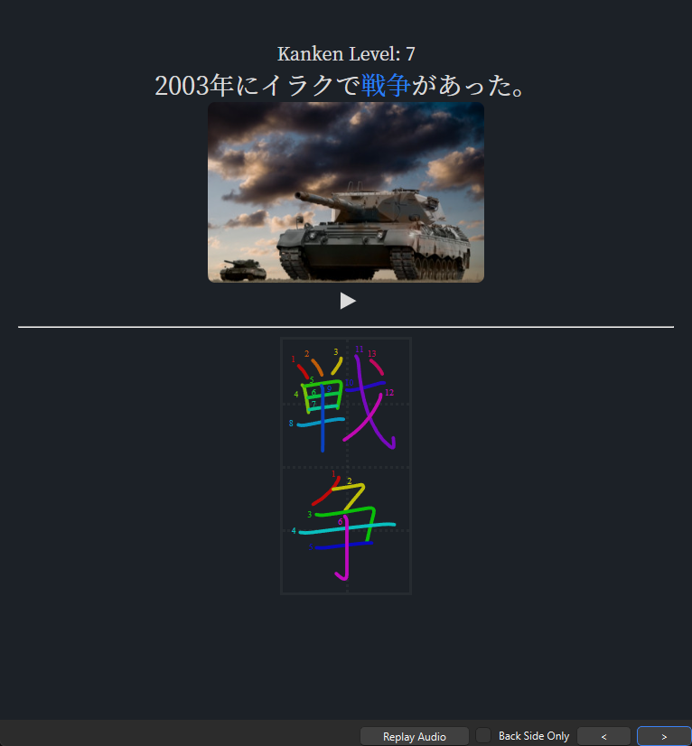

# JP-study

- [Anki Mining Template](#anki-mining-template)
  - [Yomichan fields](#yomichan-fields)
  - [Other applications/add-ons](#other-applicationsadd-ons)
- [Yomichan Handlebars templates](#yomichan-handlebars-templates)
- [Yomichan popup custom CSS](#yomichan-popup-custom-css)
- [Kanken Deck Template](#kanken-deck-template)

## Anki Mining Template

Anki Mining card template for Japanese.

[Download](https://github.com/rudnam/JP-study/raw/main/Mining_temp.apkg)

<p align="center">
    <kbd></kbd>
    <kbd></kbd>
    <kbd></kbd>
</p>

### Yomichan fields

| Field              | Value                                             |
| ------------------ | ------------------------------------------------- |
| Expression         | `{expression}`                                    |
| ExpressionFurigana | `{furigana-plain}`                                |
| ExpressionReading  | `{reading}`                                       |
| ExpressionAudio    | `{audio}`                                         |
| MainDefinition     | `{selection-text}`                                |
| Sentence           | `{cloze-prefix}<b>{cloze-body}</b>{cloze-suffix}` |
| SentenceFurigana   |                                                   |
| SentenceAudio      |                                                   |
| FullDefinition     | `{glossary}`                                      |
| Image              |                                                   |
| Translation        |                                                   |
| PitchPosition      | `{pitch-accent-positions}`                        |
| Hint               |                                                   |
| Frequency          | `{frequencies}`                                   |
| FreqSort           |                                                   |
| MiscInfo           | `{document-title}`                                |
| ExtraField         |                                                   |
| \*IsSentenceCard   |                                                   |

Notes:

- When the **\*IsSentenceCard** field is filled with any character, card is turned into a sentence card. When empty, it is turned into a vocab card.
- The **MainDefinition** field is for the displayed definition on the card. When empty, the template displays a definition from the **FullDefinition** field. The preferred dictionaries for the default definition can be changed in the [back template](https://github.com/rudnam/JP-study/blob/da0fcca7242513065a5706b58e089a38baab584e/2_Mining_Back.html#L653-L667).
- The **PitchPosition** field takes in `{pitch-accent-positions}`. `{pitch-accents}` and `{pitch-accent-graphs}` will **not** work.
- The **FreqSort** field is for frequency sorting. (See [freq](https://github.com/MarvNC/JP-Resources#sorting-mined-anki-cards-by-frequency))
- The **Hint** field is for a hint on the front of the card (See [Animecards](https://animecards.site/ankicards/#the-hint-field)).
- The furigana fields only take in plain furigana. (e.g. 漢字[かんじ] not <ruby>漢字<rt>かんじ</rt></ruby>).

### Other applications

More info can be added using other applications.

- For [mpvacious](https://github.com/Ajatt-Tools/mpvacious), fields can be filled like the following. In `subs2srs.conf`:

  ```
  model_name=Mining-JP

  sentence_field=Sentence
  secondary_field=Translation
  audio_field=SentenceAudio
  image_field=Image
  miscinfo_field=MiscInfo

  # The tag(s) added to new notes. Spaces separate multiple tags.
  note_tag=subs2srs アニメ::%n
  ```

- For [jidoujisho](https://github.com/lrorpilla/jidoujisho), fields can be filled like the following:

  | Field              | Value          |
  | ------------------ | -------------- |
  | Expression         | Term           |
  | ExpressionFurigana | Furigana       |
  | ExpressionReading  | Reading        |
  | ExpressionAudio    | Term Audio     |
  | Sentence           | Sentence       |
  | SentenceAudio      | Sentence Audio |
  | FullDefinition     | Meaning        |
  | Image              | Image          |
  | FreqSort           | Frequency      |
  | MiscInfo           | Context        |

  - [x] Include image/audio HTML tags on export
  - [x] Use line break tag instead of newline on export
  - [x] Prepend dictionary name in meaning

## Yomichan Handlebars templates

Custom Yomichan Handlebars templates.

- `{selection-text-modified}` - Basically the same as the built-in `{selection-text}` but will ignore selected text if it is the same as the target vocab (for Yomichan search page).

  ```handlebars
  {{~#*inline "selection-text-modified"~}}
    {{~#set "selected"}}{{~> selection-text}}{{/set~}}
    {{~#set "pattern1"~}}
        [
        {{~#regexReplace "(<span class=\"term\">)|(</span>)|(<ruby>)|(</ruby>)|(<rt>)|(</rt>)|[\[\]]" "" "g"~}}
        {{~> cloze-body}}
        {{~/regexReplace~}}
        ]
    {{~/set~}}
    {{~#set "pattern2"~}}
        [
        {{~#regexReplace "(<span class=\"term\">)|(</span>)|(<ruby>)|(</ruby>)|(<rt>)|(</rt>)|[\[\]]" "" "g"~}}
        {{~#getMedia "textFurigana" definition.cloze.body escape=false}}{{~/getMedia~}}
        {{~/regexReplace~}}
        ]
    {{~/set~}}
    {{~#set "diff1"}}{{~#regexReplace (get "pattern1") ""~}}{{~#get "selected"}}{{/get~}}{{~/regexReplace~}}{{/set~}}
    {{~#set "diff2"}}{{~#regexReplace (get "pattern2") ""~}}{{~#get "selected"}}{{/get~}}{{~/regexReplace~}}{{/set~}}

    {{~#if (op "&&"
                (op ">" (property (get "diff1") "length") (op "-" (property (get "selected") "length") (property (get "diff1") "length")))
                (op ">" (property (get "diff2") "length") (op "-" (property (get "selected") "length") (property (get "diff2") "length")))
            )}}
        {{~> selection-text}}
    {{/if~}}
  {{~/inline~}}
  ```

- `{grammar-pt}` - fills out a field when a grammar dictionary has an entry.

  ```handlebars
  {{#*inline "grammar-pt"}}
      {{~#set "grammar-dicts" ~}}
          {{~#regexMatch "JLPT文法解説まとめ|日本語文法辞典\(全集\)"~}}
              {{~> glossary}}
          {{~/regexMatch~}}
      {{/set~}}
      {{~#if (op "!==" "" (get "grammar-dicts"))~}}x{{/if}}
  {{/inline}}
  ```

- `{context}` - Context tag. e.g. `ラノベ::また、同じ夢を見ていた` if in ttsu, etc. Used with [Field To Tag](https://ankiweb.net/shared/info/1600845494) or [FieldReporter](https://ankiweb.net/shared/info/569864517)

  ```handlebars
  {{#*inline "context"}}
      {{~#if (regexMatch "reader\.ttsu\.app" "" definition.url)~}}
          {{~#set "ln-title" ~}}{{~#regexReplace " |　" "_"~}}
              {{~#regexMatch ".+?(?= \| ッツ Ebook Reader)"~}}{{~context.document.title~}}{{~/regexMatch~}}
          {{~/regexReplace~}}{{/set~}}
          ラノベ::{{~get "ln-title"~}}
      {{~else if (regexMatch "mokuro" "" context.document.title)~}}
          {{~#set "manga-title" ~}}{{~#regexReplace " |　" "_"~}}
              {{~#regexMatch ".+?(?= \| mokuro)"~}}{{~context.document.title~}}{{~/regexMatch~}}
          {{~/regexReplace~}}{{/set~}}
          漫画::{{~get "manga-title"~}}
      {{~else if (regexMatch "nhk.or.jp" "" definition.url)~}}
          ニュース::NHKニュース
      {{~else if (regexMatch "news.yahoo.co.jp" "" definition.url)~}}
          ニュース::Yahooニュース
      {{~else if (regexMatch "twitter.com" "" definition.url)~}}
          ツイッター
      {{~else if (regexMatch "youtube.com" "" definition.url)~}}
          {{~#set "youtube-title" ~}}{{~#regexReplace " |　" "_"~}}
              {{~#regexMatch ".+?(?= - YouTube)"~}}{{~context.document.title~}}{{~/regexMatch~}}
          {{~/regexReplace~}}{{/set~}}
          ユーチューブ::{{~get "youtube-title"~}}
      {{~/if~}}
  {{/inline}}
  ```

## Yomichan popup custom CSS

Custom CSS for changing the Yomichan popup appearance.


<kbd></kbd>

<br>

Font download links:

- Source Sans 3: [https://fonts.google.com/specimen/Source+Sans+3](https://fonts.google.com/specimen/Source+Sans+3)
- Source Han Sans: [https://github.com/adobe-fonts/source-han-sans/raw/release/Variable/TTF/SourceHanSans-VF.ttf](https://github.com/adobe-fonts/source-han-sans/raw/release/Variable/TTF/SourceHanSans-VF.ttf)
- UD Digi Kyokasho N-R: [https://learnjapanese.moe/font/#windows-10](https://learnjapanese.moe/font/#windows-10)

Just copy and paste the following CSS into Yomichan's custom CSS.

```css
body {
  font-family: "Source Sans 3", "Source Han Sans VF", sans-serif;
}

.headword {
  font-family: "UD Digi Kyokasho N-R";
}

:root[data-theme="dark"] {
  --text-color: #ffffff;
  --background-color: #0d1117;
  --accent-color: #ffb454;
  --accent-color-lighter: #ffca85;
  --tag-pronunciation-dictionary-background-color: #252d41;
  --tag-dictionary-background-color: #252d41;
  --tag-frequency-background-color: #252d41;
  --tag-default-background-color: #51647e;
  --tag-name-background-color: #3d4993;
  --tag-expression-background-color: #4857ae;
  --tag-popular-background-color: #232d5a;
  --tag-frequent-background-color: #303e7c;
  --tag-archaism-background-color: #533642;
  --tag-part-of-speech-background-color: #636a72;
  --input-background-color: #24292f;
  --link-color: #3d4993;
}

/* Fix quotes (https://aquafina-water-bottle.github.io/jp-mining-note/jpresources/#ensuring-properly-quotes-the-text) */
.jp-quote-text {
  text-indent: -1em;
  padding-left: 1em;
}

/* Only show NHK pitch when アクセント辞典 doesn't have data */
:not(ol[data-count="1"]) > li.pronunciation-group[data-dictionary="NHK"] {
  display: none;
}
ol.pronunciation-group-list[data-count="2"] {
  list-style: none;
  padding: 0;
}

/* Disable furigana on search page */
ruby.query-parser-segment > rt.query-parser-segment-reading {
  display: none;
}

/* Collapse lists of links */
.definition-item:not([data-dictionary="JMdict (English)"])
  .gloss-list:has(.gloss-content > a:only-child) {
  list-style: none;
  display: inline;
  padding-left: 0;
}
.definition-item:not([data-dictionary="JMdict (English)"])
  .gloss-list:has(.gloss-content > a:only-child)
  * {
  display: inline;
}
.definition-item:not([data-dictionary="JMdict (English)"])
  .gloss-item:has(.gloss-content > a:only-child):not(:last-child)::after {
  content: " | ";
}

/* Collapse JMnedict entries */
.definition-item[data-dictionary="JMnedict"] .gloss-list {
  list-style: none;
  display: inline;
  padding-left: 0;
}
.definition-item[data-dictionary="JMnedict"] .gloss-list * {
  display: inline;
}
.definition-item[data-dictionary="JMnedict"]
  .gloss-list
  > .gloss-item:not(:last-child)::after {
  content: " | ";
}

/* Only show summary for Pixiv */
[data-sc-pixiv="children"],
[data-sc-pixiv="related-tags"],
[data-sc-pixiv="continue-reading"],
[data-sc-pixiv="nav-header"] {
  display: none;
}

/* Only shows the first 2 frequency lists */
span.frequency-group-item:nth-child(n + 3) {
  display: none;
}
/* Show on hover */
span.frequency-group-item:first-child:hover ~ * {
  display: inline-block;
}
```

## Kanken Deck Template

Anki card template for the [Kanken Deck](https://ankiweb.net/shared/info/759825185).

<p align="center">
    <kbd></kbd>
</p>

Font download link: [https://github.com/adobe-fonts/source-han-serif/raw/release/Variable/TTF/SourceHanSerif-VF.ttf](https://github.com/adobe-fonts/source-han-serif/raw/release/Variable/TTF/SourceHanSerif-VF.ttf)

Just copy and paste the following templates into Anki.

- Front Template

  ```html
  <div id="deck" deck_name="{{Deck}}"></div>
  <div id="content">
    Kanken Level: ?
    <div lang="ja" class="sentence">{{SentenceFront}}</div>
    {{#Picture}} {{Picture}}
    <br />
    {{/Picture}} {{KankenAudio}}
    <hr />
    <div id="container">
      <div id="diagram" style="opacity: 0">{{Diagram}}</div>
    </div>
  </div>

  <script>
    function addScriptToHead() {
      let head = document.getElementsByTagName("head")[0];

      // For loading japanese fonts from web
      let scriptElement = document.createElement("script");
      scriptElement.innerHTML =
        "(function(d) {var config = {kitId: 'uud0evt',scriptTimeout: 3000,async: true},h=d.documentElement,t=setTimeout(function(){h.className=h.className.replace(/\\bwf-loading\\b/g,'')+' wf-inactive';},config.scriptTimeout),tk=d.createElement('script'),f=false,s=d.getElementsByTagName('script')[0],a;h.className+=' wf-loading';tk.src='https://use.typekit.net/'+config.kitId+'.js';tk.async=true;tk.onload=tk.onreadystatechange=function(){a=this.readyState;if(f||a&&a!='complete'&&a!='loaded')return;f=true;clearTimeout(t);try{Typekit.load(config)}catch(e){}};s.parentNode.insertBefore(tk,s)})(document);";

      head.appendChild(scriptElement);
    }

    function makeGrid() {
      const TATEGAKI = true; /* toggle vertical writing */
      const NUMOFBOXES =
        -1; /* specify # of boxes; -1 to change based on word, 0 to hide */
      const MAXBOXSIZE = 140; /* specify max boxsize (in px) */

      const boxSize = Math.min(
        document.documentElement.clientWidth / 4.5,
        MAXBOXSIZE
      );
      const container = document.getElementById("container");
      const diagram = document.getElementById("diagram");

      for (child of diagram.children) {
        child.style.height = `${boxSize}px`;
        child.style.width = `${boxSize}px`;
      }
      const diagramHTML = container.innerHTML;

      let fullSize =
        NUMOFBOXES === -1
          ? boxSize * diagram.childElementCount
          : boxSize * NUMOFBOXES;
      let currSize = boxSize / 2;

      container.innerHTML = "";
      if (TATEGAKI) {
        container.style.height = `${fullSize}px`;
        container.style.width = `${boxSize}px`;
        container.innerHTML += `<div class="vert-line" style="height:${fullSize}px;width:${
          boxSize / 2
        }px"></div>`;
        while (currSize < fullSize) {
          container.innerHTML += `<div class="hori-line" style="height:${currSize}px;width:${boxSize}px;"></div>`;
          currSize += boxSize / 2;
        }
        container.innerHTML += diagramHTML;
      } else {
        container.style.height = `${boxSize}px`;
        container.style.width = `${fullSize}px`;
        container.innerHTML += `<div class="hori-line" style="height:${
          boxSize / 2
        }px;width:${fullSize}px"></div>`;
        while (currSize < fullSize) {
          container.innerHTML += `<div class="vert-line" style="height:${boxSize}px;width:${currSize}px;"></div>`;
          currSize += boxSize / 2;
        }
        container.innerHTML += diagramHTML;
      }

      if (NUMOFBOXES === 0) {
        container.style.border = "none";
        for (child of container.children) {
          child.style.border = "none";
        }
      }

      return;
    }

    makeGrid();
    if (navigator.userAgentData.mobile) {
      addScriptToHead();
    }
  </script>
  ```

- Back Template

  ```html
  <div id="deck" deck_name="{{Deck}}"></div>
  <div id="content">
    Kanken Level: {{KankenLevel}}
    <div lang="ja" class="sentence">{{SentenceBack}}</div>
    {{#Picture}} {{Picture}}
    <br />
    {{/Picture}} {{KankenAudio}}
    <hr />
    <div id="container">
      <div id="diagram">{{Diagram}}</div>
    </div>
    <div lang="ja" id="extra">
      {{Kana}}【{{Kanji}}】
      <br />
      {{Meaning}}
    </div>
  </div>

  <script>
    function makeGrid() {
      const TATEGAKI = true; /* toggle vertical writing */
      const NUMOFBOXES =
        -1; /* specify # of boxes; -1 to change based on word, 0 to hide */
      const MAXBOXSIZE = 140; /* specify max boxsize (in px) */

      const boxSize = Math.min(
        document.documentElement.clientWidth / 4.5,
        MAXBOXSIZE
      );
      const container = document.getElementById("container");
      const diagram = document.getElementById("diagram");

      for (child of diagram.children) {
        child.style.height = `${boxSize}px`;
        child.style.width = `${boxSize}px`;
      }
      const diagramHTML = container.innerHTML;

      let fullSize =
        NUMOFBOXES === -1
          ? boxSize * diagram.childElementCount
          : boxSize * NUMOFBOXES;
      let currSize = boxSize / 2;

      container.innerHTML = "";
      if (TATEGAKI) {
        container.style.height = `${fullSize}px`;
        container.style.width = `${boxSize}px`;
        container.innerHTML += `<div class="vert-line" style="height:${fullSize}px;width:${
          boxSize / 2
        }px"></div>`;
        while (currSize < fullSize) {
          container.innerHTML += `<div class="hori-line" style="height:${currSize}px;width:${boxSize}px;"></div>`;
          currSize += boxSize / 2;
        }
        container.innerHTML += diagramHTML;
      } else {
        container.style.height = `${boxSize}px`;
        container.style.width = `${fullSize}px`;
        container.innerHTML += `<div class="hori-line" style="height:${
          boxSize / 2
        }px;width:${fullSize}px"></div>`;
        while (currSize < fullSize) {
          container.innerHTML += `<div class="vert-line" style="height:${boxSize}px;width:${currSize}px;"></div>`;
          currSize += boxSize / 2;
        }
        container.innerHTML += diagramHTML;
      }

      if (NUMOFBOXES === 0) {
        container.style.border = "none";
        for (child of container.children) {
          child.style.border = "none";
        }
      }

      return;
    }
    makeGrid();
  </script>
  ```

- Styling

  ```css
  html.win,
  html.mac,
  html.linux:not(.android) {
    --main-font: "Source Han Serif", serif;
  }

  html.mobile {
    --main-font: source-han-serif-japanese, serif;
  }

  .card.nightMode {
    --main-bg: #0b0e14;
    --sub-bg: #11151c;
    --main-color: #ffffff;
    --sub-color: #7d8590;
    --grey: rgba(128, 128, 128, 0.1);
    --accent: #ffb454;
    font-family: var(--main-font);
    background-color: var(--main-bg);
    color: var(--main-color);
    font-size: 20px;
    text-align: center;
  }

  #qa {
    display: flex;
    align-items: stretch;
    flex-direction: column;
    min-height: calc(100vh - 40px);
  }

  @font-face {
    font-family: "Source Han Serif";
    src: local("Source Han Serif VF"), url("_SourceHanSerif-Regular.otf");
  }

  /* ----- Front elements ----- */
  #content {
    margin-top: 24px;
  }

  .sentence {
    font-size: 28px;
  }

  /* PC replay button */
  .replay-button {
    margin-top: -5px;
  }
  .replay-button svg {
    width: 30px;
    height: auto;
  }
  .replay-button svg path {
    fill: var(--main-color);
    transition: 0.2s;
  }
  .replay-button svg circle {
    fill: var(--main-bg);
    display: none;
  }
  .replay-button:hover svg path {
    fill: var(--sub-color);
  }

  /* Grid */
  #container {
    margin: auto;
    border-style: solid;
    border-color: var(--grey);
    background-color: rgba(255, 255, 255, 0);
  }
  .vert-line {
    position: absolute;
    border-style: none;
    border-right-style: dotted;
    border-color: var(--grey);
  }
  .hori-line {
    position: absolute;
    border-style: none;
    border-bottom-style: dotted;
    border-color: var(--grey);
  }

  /* ----- Back elements ----- */

  /* Stroke diagram */
  #diagram {
    line-height: 0;
  }
  #diagram > img {
    height: 140px;
    width: 140px;
    position: relative;
    z-index: 100;
  }

  /* Extra info */
  #extra {
    opacity: 0;
  }

  #extra:hover {
    opacity: 1;
  }

  /* ---------- Misc ---------- */

  /* Remove default margins */
  * {
    margin: 0px;
    padding: 0px;
  }

  /* Images */
  img {
    height: 200px;
    width: auto;
    border-radius: 8px;
  }

  /* Underline CSS */
  u {
    text-decoration: none;
    color: var(--accent);
    font-weight: 400;
  }

  /* Line margins */
  hr {
    margin-top: 0.5em;
    margin-bottom: 0.5em;
  }
  ```
